  

# Awesome Kubernetes Security Platform & Ecosystem 🛡️⚡

  
  
  
  
  
  

A curated list of top-tier **Kubernetes Security Platforms** (SaaS & Open-Source) focusing on **Cloud-Native Application Protection Platforms (CNAPP)**, **Kubernetes Security Posture Management (KSPM)**, **Container Runtime Threat Detection**, **eBPF Security Observability**, **Admission Control**, and **Software Supply Chain Security**. 🔒🚀

> **💡 Market Insights (2026):** The global Kubernetes and Cloud Container Security market is estimated at **~$3.8 Billion - $4.5 Billion**, growing at a CAGR of >22%. The market is **moderately fragmented**, featuring high-valuation hyper-scalers and CNAPP giants (Palo Alto Networks, Wiz, Sysdig, Snyk) alongside specialized pure-play innovators (Chainguard, ARMO, Cast AI). 📊

---

## 📋 Table of Contents
- [☁️ SaaS & Enterprise Platforms](#️-saas--enterprise-platforms)
- [🔓 Open-Source GitHub Projects](#-open-source-github-projects)
- [🏗️ Category Matrix & Reference Security Stack](#️-category-matrix--reference-security-stack)
- [🤝 How to Contribute](#-how-to-contribute)
- [💖 Support & Sponsorship](#-support--sponsorship)
- [⚖️ Disclaimer & Best Practices](#️-disclaimer--best-practices)
- [📈 Star History](#-star-history)

---

## ☁️ SaaS & Enterprise Platforms 🏢

Below is a comparison of commercial Kubernetes Security Platforms, sorted by company size (Valuation / Market Cap / Revenue descending). 💰

| Platform / Vendor | Enterprise Description | Company Size (Valuation / Revenue / Market Cap) | Pricing Model & Starting Tier | Free Tier / Trial Limit |
| :--- | :--- | :--- | :--- | :--- |
| **[Palo Alto Prisma Cloud](https://www.paloaltonetworks.com/prisma/cloud)** | Comprehensive CNAPP assembled from Twistlock & RedLock. CIS Benchmarks, CRI-O runtime mapping, and vulnerability management. | **~$110B+ Market Cap** | ~$300 / credit / year (or ~$90–$120/host/yr equivalent via cloud marketplaces) | 30-day free trial with full feature access |
| **[Wiz](https://www.wiz.io/)** | Agentless & eBPF CNAPP providing Kubernetes visibility via KBOM, Network Graph, and Admission Controller policy enforcement. | **~$12B Valuation** | ~$3,000 / year base platform + ~$60–$100 / workload unit / yr | 14-day full platform free trial |
| **[Red Hat ACS (StackRox)](https://www.redhat.com/en/technologies/cloud-computing/openshift/advanced-cluster-security-for-kubernetes)** | Kubernetes-native security platform protecting build, deploy, and runtime across CIS, NIST, and PCI compliance benchmarks. | **Red Hat ($35B IBM Div / ~$5.3B Rev)** | ~$1,200 / node / year (or included in OpenShift Platform Plus) | 60-day free trial subscription |
| **[Snyk](https://snyk.io/)** | Developer-first security platform with Kubernetes Controller scanning running workloads for CVEs and misconfigurations. | **~$7.4B Valuation** | Team Plan starting at **$25 / developer / month** | **Free Forever**: 200 container tests / month |
| **[Sysdig Secure](https://sysdig.com/products/secure/)** | CNAPP built by Falco creators. eBPF instrumentation, syscall forensics, Host/Cluster Shield, and KSPM posture control. | **~$2.5B Valuation** | Pro Plan starting at **$24 / host / month** | 30-day free trial (up to 50 hosts) |
| **[Aqua Security](https://www.aquasec.com/)** | Enterprise CNAPP with Aqua Enforcer, drift prevention, immutable container policies, and MalwareScan base image protection. | **~$1.5B Valuation** | Developer/Standard starting at **$0.99 / workload hour** or ~$1,500/mo min commit | 14-day free trial on Aqua Cloud |
| **[Tigera Calico Cloud](https://www.tigera.io/tigera-products/calico-cloud/)** | Active security and network policy platform built on Calico eBPF dataplane with L7 control and Istio ambient mode. | **~$500M+ Valuation** | Starter Pay-As-You-Go at **$0.05 / node / hour** (~$36/node/month) | **Free Forever**: Up to 1 cluster & 10 nodes |
| **[Chainguard](https://www.chainguard.dev/)** | Zero-CVE base container images & FIPS-validated EKS add-ons (CoreDNS, VPC CNI, kube-proxy). | **~$380M Valuation** | Enterprise Tier starting at **$2,000 / month** for custom image streams | **Free Forever**: Public Developer base images |
| **[Cast AI Security](https://cast.ai/)** | Kubernetes cost & security platform. Powered by Kvisor, providing automated CVE scanning & CIS benchmarks. | **~$250M+ Valuation** | Growth Plan starting at **$150 / cluster / month** | **Free Forever**: Free cluster audit & vulnerability scanning |
| **[Fairwinds Insights](https://www.fairwinds.com/insights)** | Kubernetes governance & security platform providing admission control policies, CVE auditing, and multi-cluster dashboards. | **~$50M+ Estimated Value** | Scale Plan starting at **$150 / cluster / month** | **Free Forever**: Up to 2 clusters & 20 nodes |
| **[ARMO Platform](https://www.armosec.io/)** | Commercial enterprise platform built on open-source Kubescape. Provides security graph, application profiles, and runtime security. | **~$40M+ Estimated Value** | Enterprise starting at **$19 / node / month** | **Free Forever**: Up to 10 nodes & 1 cluster |

---

## 🔓 Open-Source GitHub Projects 🛠️

Curated list of active open-source Kubernetes security tools, sorted by GitHub_Stars (descending). ⭐

| Project | GitHub_Stars | Primary Focus & License | Description |
| :--- | :--- | :--- | :--- |
| **[Trivy](https://github.com/aquasecurity/trivy)** |  | Vulnerability & Misconfiguration Scanner *(Apache-2.0)* | Comprehensive security scanner for container images, file systems, Git repos, Kubernetes clusters, and SBOM generation. 🔍 |
| **[Falco](https://github.com/falcosecurity/falco)** |  | eBPF Runtime Threat Detection *(Apache-2.0)* | CNCF Graduated runtime security engine monitoring kernel syscalls for anomalous behavior and security violations. 🦅 |
| **[Kyverno](https://github.com/kyverno/kyverno)** |  | Policy & Admission Control *(Apache-2.0)* | CNCF Incubating Kubernetes-native policy engine for admission validation, mutation, generation, and image verification in YAML. 📋 |
| **[Kubescape](https://github.com/kubescape/kubescape)** |  | KSPM & Runtime Security *(Apache-2.0)* | CNCF Incubating platform for posture management, RBAC visualizer, vulnerability scanning, and eBPF runtime threat detection. 🛡️ |
| **[OPA Gatekeeper](https://github.com/open-policy-agent/gatekeeper)** |  | Policy & Admission Control *(Apache-2.0)* | CNCF Graduated policy controller executing Open Policy Agent (OPA) constraints written in Rego for Kubernetes admission. 🚪 |
| **[Cosign / Sigstore](https://github.com/sigstore/cosign)** |  | Supply Chain & Image Signing *(Apache-2.0)* | Container signing, verification, and storage in OCI registries. Standard for supply chain security in Kubernetes workloads. ✍️ |
| **[Cilium Tetragon](https://github.com/cilium/tetragon)** |  | eBPF Security Observability & Enforcement *(Apache-2.0)* | Deep kernel-level security observability and process-level real-time enforcement using eBPF and `bpf_send_signal()`. 🐝 |
| **[Tracee](https://github.com/aquasecurity/tracee)** |  | Linux & Container eBPF Forensics *(Apache-2.0)* | eBPF-driven Linux tracing and runtime security tool built by Aqua Security to catch suspicious behavioral patterns. 🐾 |
| **[NeuVector](https://github.com/neuvector/neuvector)** |  | Full Lifecycle Container Security *(Apache-2.0)* | Open-source end-to-end container security platform with layer-7 container firewall, vulnerability scanning, and CIS benchmarks. 🧱 |
| **[KubeArmor](https://github.com/kubearmor/KubeArmor)** |  | LSM-based Runtime Enforcement *(Apache-2.0)* | CNCF Sandbox project leveraging AppArmor, SELinux, and BPF-LSM for process execution restriction and workload inline hardening. ⚔️ |
| **[Syft](https://github.com/anchore/syft)** |  | Software Bill of Materials (SBOM) *(Apache-2.0)* | CLI tool and library for generating a Software Bill of Materials (SBOM) from container images and filesystems. 📦 |
| **[Grype](https://github.com/anchore/grype)** |  | Vulnerability Scanner *(Apache-2.0)* | Fast vulnerability scanner for container images and filesystems, designed to work seamlessly with Syft SBOMs. 🎯 |
| **[Pixie](https://github.com/pixie-io/pixie)** |  | eBPF K8s Observability *(Apache-2.0)* | CNCF Sandbox project for automatic eBPF-based Kubernetes observability, network tracing, and security monitoring. 🧚 |
| **[Inspektor Gadget](https://github.com/inspektor-gadget/inspektor-gadget)** |  | eBPF Introspection Tools *(Apache-2.0)* | Collection of eBPF tools and gadgets for debugging, inspecting, and securing Kubernetes applications. 🕵️‍♂️ |
| **[Kubewarden](https://github.com/kubewarden/kubewarden-controller)** |  | WebAssembly Policy Engine *(Apache-2.0)* | CNCF Sandbox policy engine for Kubernetes allowing policy writing using WebAssembly (WASM) in standard languages. 🧙‍♂️ |
| **[Clair](https://github.com/quay/clair)** |  | Container Vulnerability Analysis *(Apache-2.0)* | Open-source vulnerability parsing engine for container images developed by CoreOS / Red Hat Quay. 🔮 |
| **[KubeCop](https://github.com/armosec/kubecop)** |  | Runtime Detection & Response *(Apache-2.0)* | Automated detection and enforcement operator for malicious events in Kubernetes clusters built by ARMO. 👮‍♂️ |

---

## 🏗️ Category Matrix & Reference Security Stack 🎯

### Recommended 2026 Reference Security Stack ⚙️
For platform teams and security architects building a comprehensive zero-trust Kubernetes environment:

1. **Software Supply Chain & CI/CD**: [Trivy](https://github.com/aquasecurity/trivy) (CVE scanning) + [Syft](https://github.com/anchore/syft) (SBOM) + [Cosign](https://github.com/sigstore/cosign) (Image Signing). 🔐
2. **Admission Control & Policy**: [Kyverno](https://github.com/kyverno/kyverno) or [OPA Gatekeeper](https://github.com/open-policy-agent/gatekeeper) for cluster posture enforcement. 📜
3. **Runtime Threat Detection**: [Falco](https://github.com/falcosecurity/falco) or [Cilium Tetragon](https://github.com/cilium/tetragon) (eBPF kernel syscall monitoring). ⚡
4. **Active Prevention & Hardening**: [KubeArmor](https://github.com/kubearmor/KubeArmor) (LSM process restriction) + [Kubescape](https://github.com/kubescape/kubescape) (Posture management & CIS benchmarks). 🛡️
5. **Observability & Routing**: Prometheus + Grafana with [Falcosidekick](https://github.com/falcosecurity/falcosidekick) for alert notifications. 📊

---

## 🤝 How to Contribute 💡

Contributions are welcome! If you know of an awesome Kubernetes security platform or open-source tool, feel free to submit a pull request. 🌟

1. Fork the repository. 🍴
2. Update `README.md` with your tool (ensure standard table formatting and links). 📝
3. Open a Pull Request with a brief explanation of the tool. 🚀

---

## 💖 Support & Sponsorship ☕

Thank you for visiting and taking the time to explore this resource! If you find this curated ecosystem list helpful for your cloud-native security research or daily engineering workflows:

- ⭐ **Star this repository** to help others discover it!
- 🍴 **Fork it** to customize your own security reference lists.
- 📢 **Share it** with your network, platform engineers, and security teams!
- ☕ **Sponsor / Buy me a coffee**: Support ongoing open-source maintenance via [GitHub Sponsors](https://github.com/sponsors/ishandutta2007).

Your support is deeply appreciated! ❤️

---

## ⚖️ Disclaimer & Best Practices ⚠️

- This is a community-curated list and does not constitute an endorsement. ℹ️
- Ensure eBPF vs kernel-module sensor compatibility with your Linux node kernel version before production rollout. 🐧
- **Detection vs. Prevention**: Tools like Falco and Tracee focus on alert detection. Pair them with active enforcers like Tetragon, KubeArmor, or Kyverno for mitigation. 🛑

---

## 📈 Star History

